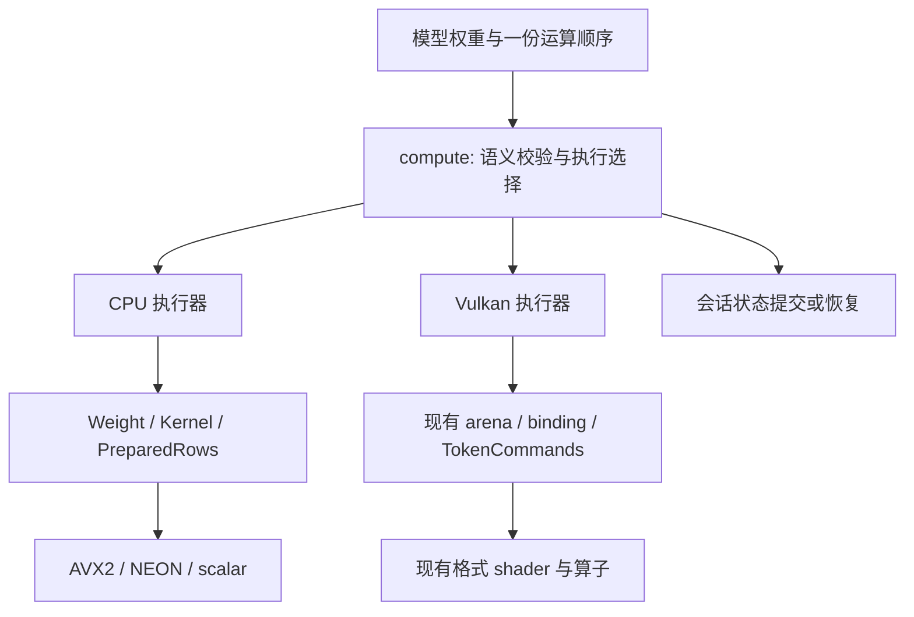

# 统一计算分发与 Vulkan 复用 Implementation Plan

> **For agentic workers:** REQUIRED SUB-SKILL: Use superpowers:executing-plans to implement this plan task-by-task. Steps use checkbox (`- [ ]`) syntax for tracking. 结构探索直接使用 CodeGraph；实施方式以用户后续指令为准。

**Goal:** 模型表达一份运算流程，公共执行层根据计算语义、权重格式、形状和设备能力选择 CPU/Vulkan；CPU 内部继续自动选择 AVX2/NEON/scalar。

**Architecture:** 保留现有 `Weight`、`Kernel`、`PreparedRows` 和 Vulkan shader，实现独立于模型的执行层。先统一无状态 linear，再提取 CPU/Vulkan 共用的 dense block 运算顺序；GPU 内存和提交边界由执行器管理，KV/SSM 的提交仍遵守各模型的状态契约。

**Tech Stack:** Rust 2021、现有 `ash`/Vulkan、GLSL/SPIR-V、`ComputePool`；不增加依赖。

**Spec:** 本文“设计契约”是本计划的内嵌设计说明；与旧设计的差异见“已有设计的取舍”。

**调研基线:** 2026-10-08，`ce17cd5d04076e13f7e72b40bb58713630ac16c3`（`Newfix (#160)`）。

**证据边界:** 已检查源代码、已有设计、测试入口和 CI 配置。本次仅编写计划，没有运行编译、GPU 正确性或性能测试；本文不把历史文档中的测试数量、设备结果和性能数字视为当前结论。

**实施跟踪（2026-10-09）：** 上述证据边界是编写计划时的状态。当前 Task 1–8 的代码与可用环境验收已执行，自动加速目标未达成；
验收结果、未覆盖项和裁决集中记录在
[统一计算验证记录](../../develop/UNIFIED_COMPUTE_VALIDATION.md)。保留下方原计划清单作为验收要求，
不将合成测试、历史结果或基线失败写成真实模型加速通过。

## Global Constraints

- 普通 CPU 构建继续使用 `default = []`，Vulkan 由 `--features vulkan` 编译启用。
- 保留权重的 mmap/借用关系；不把 F16、Q4、BF16 统一重新量化为 Q8，不把全模型解压为 F32。
- 保持现有公开 Model/Session 路径和 CLI 默认行为。没有 GPU 参数仍选择 CPU；不顺带修改采样、KV 格式、prefill batch 或上下文默认值。
- 模型调用点不新增 `target_arch`、`GGMLType`、原始字节布局或 Vulkan shader 分支；这些判断属于 kernel、加载适配器或执行层。
- CPU 数值语义保持原路径；GPU 按具体契约验证容差。已经要求 raw-bit parity 的路径不能改成“容差内就算通过”。
- 常规迭代用 `--profile release-fast`；最终性能测量用相同配置的 `--release`。不沿用技能/旧文档中的历史失败数量。
- GPU 失败时，不释放仍可能被设备使用的资源；不在已经污染的状态上重复执行当前 token/chunk。
- 每阶段单独形成可运行、可验收的改动。迁移已有入口前，保留其基线与回退检查。

## Review Focus

1. 混合量化、相同长度但不同格式、缺少原始存储视图：不能误选 shader 或错误复用缓存，归 Task 2。
2. F16 不同激活舍入、Gemma4 特定归约、Q8_0/Q8_K 激活：不能只按 dtype 判断可替换性，归 Task 1–3。
3. 非零起点的第二个 chunk 失败，随后 CPU 重算也失败：成功前缀和两个错误来源必须保留，归 Task 5。
4. CPU/Auto 会话交替使用同一线程池或设备，超时后资源仍在执行：全局开关和缓存不能串会话，归 Task 1、2、5。
5. 仅部分 linear 上 GPU、真实模型缺失、设备检查被跳过：不能报告完整 GPU 推理或已加速，归 Task 7、8。

---

## 1. 深入检查后的结论

应统一计算入口，但目前缺的不是一个“检测到 Vulkan 就调用它”的分支。已有的 CPU 类型分发、局部 GPU 分发、完整 GPU 会话分别解决了不同问题，需要在保持其正确性边界的前提下收敛。

### 1.1 当前实际调用链

```text
GGUF / TensorSource
  → QuantizedTensor::into_kernel
  → Weight { kernel, ggml_type, n_in, n_out }
  → Kernel::forward / forward_prepared / forward_batched
  → 各格式内核 → AVX2 / NEON / scalar

Vulkan 目前有三种接入粒度：
  Q8 parallel_rows → VulkanContext::matmul_q8_0 → 单次 matmul 完成后回 CPU
  Gemma4 / AuK → BatchedLinearRuntime → 缓存权重、每次 linear 提交并读回
  Qwen3 / Qwen3.5 → VulkanSession → 连续算子、GPU 状态、chunk 提交
```

### 1.2 源码证据与含义

| 位置 | 已实现的事实 | 对计划的约束 |
| --- | --- | --- |
| [quantized_tensor.rs](../../../src/ops/kernel/quantized_tensor.rs#L574) | `into_kernel()` 为不同格式构造不同实现 | 模型流程复用不等于只写 Q8 底层内核 |
| [Kernel](../../../src/ops/kernel/trait_.rs#L15)、[PreparedRows](../../../src/ops/kernel/mod.rs#L45) | CPU 接口包含 host slice、预量化激活和线程行分区 | 不在每个细粒度函数里强塞异步 GPU 操作 |
| [F16Kernel](../../../src/ops/kernel/f16/mod.rs#L192) | `forward_prepared` 会舍入 F16 激活；`forward` 可走 F16×F32 SIMD；另有严格 F16 入口 | dtype 相同不代表计算契约相同 |
| [Q8 parallel](../../../src/ops/kernel/q8_0/parallel.rs#L25) | GPU 由线程 0 计算全部行；失败时线程 0 重算全部行 | 不能把 GPU 再拆进 CPU 每线程分区，也不能回退时漏行 |
| [ops/float.rs](../../../src/ops/float.rs#L17) | 请求是进程级开关，context 经 `OnceLock` 初始化 | 新会话策略与共享设备初始化分开；旧入口可暂作包装 |
| [server](../../../src/app/server/mod.rs#L1417) | 已在构建模型前执行 `configure_gpu()` | 旧计划“server 未接通 --gpu”不适用于当前基线 |
| [GpuWeightFormat](../../../src/vulkan/ops.rs#L280) | 已有 Q8_0、Q4_0、Q4_1、Q4_K、Q5_K、Q6_K、F16、BF16、F32 | 优先复用九种已有格式，不从 Q8 重新建设 |
| [record_weight_matmul_rows](../../../src/vulkan/ops.rs#L1532) | 浮点、Q8_0、Q8_K 三种激活准备已集中；记录前做地址/形状校验 | 复用分发和校验，避免模型重复量化和类型判断 |
| [BatchedLinearRuntime](../../../src/vulkan/ops.rs#L877) | key 是指针与长度，要求权重在 runtime 生命周期内不变；每次调用提交、等待、读回 | 适合作为第一阶段实现，但不代表设备驻留；必须约束权重生命周期 |
| [Gemma4](../../../src/models/gemma4/trunk/forward.rs#L729)、[AuK](../../../src/models/diffusion/auk/mod.rs#L958) | 模型内仍分别判断类型、取 bytes、选择 GPU、处理失败；AuK 使用 static runtime | 这是应收敛的真实重复；static 缓存的跨模型生命周期是假设风险，不是已复现错误 |
| [Qwen3](../../../src/vulkan/qwen3.rs#L22)、[Qwen3.5](../../../src/vulkan/qwen35.rs#L16) | 完整会话有架构/格式/操作 eligibility；两个会话的格式集合不同，也小于算子全集 | 存在 shader 不能推出模型能完整上 GPU |
| [Qwen3 prefill](../../../src/models/qwen3/trunk/prefill.rs#L201)、[Qwen3.5 step](../../../src/models/qwen35/trunk/session.rs#L447) | 已有 shadow state、失败 chunk 重算、成功前缀保留 | 复用事务边界，不再重写另一套回退框架 |
| [Qwen3 resize](../../../src/vulkan/qwen3.rs#L474) | 增大 rows 时可能重建会话并重新上传权重 | 尽量一次按最大 batch 规划；频繁 resize 优化以测量决定 |
| [Vulkan ops](../../../src/vulkan/ops.rs#L1000) | `Qwen3Ops` 已被文本、音频、diffusion 路径复用；已有 mapped/device-local arena | 名称不等于能力范围，不先做全仓库改名或新建内存系统 |

Qwen3 的 RoPE/QK norm、Qwen3.5 的 recurrent state、Gemma4 的共享 KV/特定归约等都属于真实模型语义。自动兼容的单位是**已实现且语义匹配的算子组合**。

## 2. 设计契约

### 2.1 三种选择分层处理

| 选择 | 决策位置 | 时机 |
| --- | --- | --- |
| 权重格式与激活准备 | `Weight` / `Kernel` / Vulkan recorder | 加载或准备执行器，按动态 rows 验证 |
| CPU 或 Vulkan | 新 `compute` 执行层 | 会话/连续计算段准备时，受输入与状态约束 |
| AVX2、NEON 或 scalar | 现有 CPU 算子内部 | 保留 feature 检测及分发 |

新增依赖方向为 `models → compute → ops/core`；`compute` 可依赖 feature-gated `vulkan`。公共 compute 类型不反向依赖具体模型；已有 Vulkan 模型适配器在迁移期间保留。`ops` 的新语义类型不包含 `ash`、GPU buffer 或设备生命周期。



### 2.2 最小公共接口

第一阶段只引入有 CPU/Vulkan 两个实际实现的 linear 执行器。以下为拟新增接口，不是现有 API：

```rust
pub(crate) enum ComputePolicy { Cpu, Auto, Vulkan }
pub(crate) enum UsedBackend { Cpu, Vulkan }
pub(crate) enum LinearMode { Prepared, Forward, F16Strict }
pub(crate) enum ComputeError {
    InvalidInput(String), Unsupported(String), Device(String), State(String),
}
pub(crate) struct LinearBinding<'model, 'weights> {
    pub weight: &'model Weight<'weights>,
    pub mode: LinearMode,
}
pub(crate) struct LinearId { owner: u64, slot: usize }

impl<'model, 'weights> LinearExecutor<'model, 'weights> {
    pub(crate) fn new(
        policy: ComputePolicy,
        bindings: Vec<LinearBinding<'model, 'weights>>,
        max_rows: usize,
        pool: Arc<ComputePool>,
    ) -> Result<Self, ComputeError>;
    pub(crate) fn id(&self, index: usize) -> Result<LinearId, ComputeError>;
    pub(crate) fn run(
        &mut self, id: LinearId, input: &[f32], rows: usize, output: &mut [f32],
    ) -> Result<UsedBackend, ComputeError>;
    pub(crate) fn run_group<const N: usize>(
        &mut self, ids: [LinearId; N], input: &[f32], rows: usize,
        outputs: [&mut [f32]; N],
    ) -> Result<[UsedBackend; N], ComputeError>;
}
```

- ID 对应构造时 bindings 的下标，包含执行器身份并受检；不得跨 executor 使用。身份由单调计数分配并检查溢出，不按可复用的内存地址区分。
- `Prepared` 保留 `forward_prepared` 的激活准备方式；`Forward` 保留 `forward` 路径；`F16Strict` 调用已有严格入口，不支持时返回 `Unsupported`。
- CPU 复用 `PreparedRows` 与 Kernel，group 保留输入预量化复用；不能统一成逐行反量化。
- group 在第一条计算/上传之前校验全部绑定、输入、输出和语义；后面的无效 projection 不能让前面的输出先被修改。
- Vulkan 复用 `BatchedLinearRuntime`。按模式、格式、形状、设备判断语义兼容；没有相应语义时 Auto 走原 CPU 契约，Vulkan 明确拒绝。
- host linear 一次调用仍可能上传/读回，统计标为局部 offload。GPU group 尚未共享提交时保留实际计数，不冒充融合。
- executor 对 Weight 的借用覆盖 GPU 缓存使用期。拥有 Weight 的 session 不保存借用自身字段的 executor；采用外层借用会话，或临时 CPU view 加独立拥有上传资源的 GPU runtime。

`LinearMode` 描述原有调用语义，不由模型检查 dtype 来选择。Gemma4 特殊归约暂保留专用入口；公共化时按 `operator-internal-dispatch` 技能通过 kernel opt-in 承载，不标成普通 Forward 后改变数值。

### 2.3 策略与能力检查

最终增加 `--compute cpu|auto|vulkan`，行为固定如下；前期迁移可沿用 `--gpu` 请求：

| 参数 | 行为 |
| --- | --- |
| 无参数 / `--compute cpu` | CPU，不初始化 Vulkan，CPU 内部照常 SIMD |
| `--gpu` / `--compute auto` | 按能力及已验证规则使用 GPU，允许安全回退，记录实际路径 |
| `--compute vulkan` | 要求声明的执行范围完整使用 Vulkan；不支持或失败时报错，不隐式改 CPU |
| 同时给 `--gpu` 与 `--compute` | 参数错误，避免覆盖显式策略 |

强制 Vulkan 对 linear 检查该 linear/group；对模型 CLI 检查完整声明的模型执行范围。仅 Gemma4 的 projection 上 GPU，不能满足完整模型 Vulkan 的要求。

能力检查包含：语义模式、格式/存储视图、block 对齐、shape/stride、checked arithmetic、地址/dispatch 限制、shader 特性、组内格式、KV 类型与位置编码约束。

设备存在只证明可以尝试。Auto 的性能规则由 Task 8 的测量决定，不能写死 `Vulkan > AVX2 > scalar`。无性能资料的新增路径保守留在 CPU，显式 Vulkan 用于验收；既有 `--gpu` 路径若因此改变选择，必须记录变化。

scalar/parity 用独立进程并显式选择 CPU。`RMI_SCALAR` 仅在 `parity-trace` feature 生效，不能假设它是所有设备的总开关；严格运行不得绕回 legacy GPU 路径。

兼容期的旧入口也要遵守会话策略：CPU scope 从构造会话前覆盖到执行结束，仍会主动获取 context 的旧构造器需显式检查策略。未迁移模型不能凭进程级 `GPU_ENABLED` 满足强制 Vulkan 请求。

### 2.4 驻留与完整流程复用

第二阶段覆盖标准 causal dense decoder block：一个普通 Rust 函数配合 CPU/Vulkan 两个实现，不引入通用图编译器。

拟新增 `DenseStep`：`AttnNorm`、`Qkv`、`QkNormRope`、`AppendKv`、`Attention`、`AttnOut`、`AttnResidual`、`FfnNorm`、`GateUp`、`SiluMul`、`Down`、`FfnResidual`。

```rust
pub(crate) trait DenseBlockOps {
    fn run_step(&mut self, layer: usize, step: DenseStep) -> Result<(), ComputeError>;
}
pub(crate) fn run_dense_layer(
    executor: &mut impl DenseBlockOps, layer: usize,
) -> Result<(), ComputeError>;
```

`run_dense_layer` 只表达上述一次运算顺序。CPU 实现操作原 scratch/KV、调用现有算子；Vulkan 实现记录命令，不在 step 内提交/读回。输入 staging、循环层、最终 norm/logits、shadow 导出和提交位于 chunk 边界。

适配器提供真实形状、权重引用、可选 Q/K norm、RoPE 参数、attention scale、KV 格式、norm epsilon、最终投影及数值契约。首版只接受已迁移的标准 dense 组合；SWA、softcap、YaRN、partial RoPE、非默认 residual/embedding/logit scale、MoE、deepstack 等须逐项拒绝或有已实现步骤，不得忽略。

权重上传与 activation/KV arena 复用已有所有权代码。稳态每 chunk 一次主计算 submission；初始化、扩容、device-local staging 的 transfer submission 单独统计，不能宣称整个调用始终只有一次提交。

### 2.5 状态与失败语义

- 复用 `TokenCommitState` 的 begin/commit/abort；迁出 Qwen3 文件只是提供公共位置，不重新设计状态机。
- GPU 输出/state delta 校验通过后才更新 CPU shadow、长度和已提交位置。`abort()` 不恢复设备字节；不安全的 GPU session 应丢弃。
- Qwen3 回退重算原 chunk；Qwen3.5 同时保持 KV、conv、SSM 和四轴位置。不同模型不强制共用只有 seq_len 的状态类型。
- Auto 失败后重算整个未提交 chunk，成功前缀不重算；CPU 重试也失败时保留两个错误来源。
- 不支持格式/形状是局部拒绝，会话分配失败不等于设备损坏；共享设备/队列不安全才触发现有熔断。
- CPU 回退使用 `GpuMatmulScope` 并传播到 ComputePool worker；嵌套退出恢复原状态，避免再次触发 legacy Q8 GPU。
- 强制 Vulkan 失败也保持已提交前缀有效，但返回错误，不隐式 CPU 重试。

## 3. 已有设计的取舍

| 方案 | 处理 | 原因 |
| --- | --- | --- |
| [HETEROGENEOUS_COMPUTE](../../develop/HETEROGENEOUS_COMPUTE.md) 的全局 Backend Registry | 不作为本轮起点 | 将 ISA/GPU 放进同一 priority 列表不能表达驻留、提交、恢复；CPU 分发无需重写 |
| [Vulkan Design](../../develop/VULKAN_INFERENCE_DESIGN.md) / [Plan](../../develop/VULKAN_INFERENCE_PLAN.md) | 继承已实现部分 | 算子、buffer、shader CI、shadow 已存在；未勾选项不是新的待办依据 |
| 只统一 host-slice linear | 首个交付，不是终点 | 能下沉模型设备分支，但仍有传输/同步开销 |
| 通用 Tensor、DAG、动态插件注册 | 本轮不做 | 两个实际后端与有限 dense recipe 足以检验目标 |
| [文本运行时统一](../../develop/TEXT_RUNTIME_UNIFICATION.md) | 保持正交 | CLI/HTTP 运行时与计算后端不同，不借机改 prompt/采样/HTTP 行为 |

实施后在旧文档注明新的分层决策，保留历史背景和验证记录。

## 4. 文件范围

| 文件 | 工作 |
| --- | --- |
| 新 `src/compute/mod.rs` | 策略、错误、执行结果、模块入口及纯决策测试 |
| 新 `src/compute/linear.rs` | 受检绑定、CPU/GPU linear、局部回退及测试 |
| 新 `src/compute/dense.rs` | dense 语义/步骤/CPU 实现；第二阶段才创建 |
| 新 `src/compute/state.rs` | 迁移已有 TokenCommitState |
| 新 `src/vulkan/dense.rs` | 模型无关的 dense recorder |
| `src/lib.rs` | 声明 compute，保持公开 API |
| `src/ops/kernel/{mod.rs,trait_.rs}` | 必要的只读存储/语义 opt-in，不存设备生命周期 |
| `src/ops/float.rs`、`src/vulkan.rs` | 分离策略与 context 初始化，保留兼容入口及熔断 |
| `src/vulkan/ops.rs` | 复用/局部提取 linear、arena、binding、能力校验 |
| `src/models/gemma4/trunk/{session.rs,forward.rs,tests.rs}` | 第一个 linear 消费者 |
| `src/models/diffusion/auk/{mod.rs,dit.rs}` | 第二个 linear 消费者，修正缓存生命周期边界 |
| `src/models/qwen3/trunk/{session.rs,prefill.rs,tests.rs}`、`src/vulkan/qwen3.rs` | 共用 dense recipe 与回归 |
| `src/models/llama/trunk/{session.rs,forward.rs}` | 第二个 dense 适配器及能力拒绝 |
| `src/models/qwen35/trunk/{session.rs,tests.rs}`、`src/vulkan/qwen35.rs` | 共享策略/提交原语，不扩宣 hybrid 支持 |
| `src/app/cli/{types.rs,options.rs,parse.rs,validate.rs,tests.rs}`、`src/app/text/runtime.rs`、`src/main.rs`、`src/app/server/mod.rs` | 策略参数及传递 |
| `examples/{vk_ops_check.rs,vk_model_check.rs}`、`.github/workflows/ci.yml` | 复用验收入口与必要 CI 检查 |
| `docs/develop/{HETEROGENEOUS_COMPUTE.md,VULKAN.md}` | 能力、策略和证据边界 |

不顺带迁移全部 Vulkan 文件、展开 lib glob re-export 或清理无关 warning。

## 5. 分阶段实施

### Task 1：钉住计算语义与会话策略

**Files:** 新 `src/compute/mod.rs`；修改 `src/lib.rs`、`src/ops/float.rs`、`src/vulkan.rs`；测试放同模块，复用 `src/ops/kernel/f16/mod.rs`。

**Interfaces:** 产出 §2.2 的 ComputePolicy/UsedBackend/ComputeError。context 初始化变成共享设备服务；旧 `get_vulkan_context()` 仍按旧开关包装它，新 compute 不依赖进程级请求值。

- [ ] 保存当前 HEAD、构建参数、路径、模式和格式基线，运行 §6 相关检查；跳过项单列。
- [ ] 添加 `cpu_policy_never_initializes_vulkan`：注入初始化计数，断言为 0；`cpu_auto_sessions_do_not_share_policy`：Auto→CPU→Auto 分别遵守各自请求。
- [ ] 添加 `f16_linear_modes_preserve_existing_rounding`：跨越 F16 舍入点的输入分别与三个原入口比较 raw bits，不要求三个模式彼此相同。
- [ ] 运行新增检查观察缺失接口/行为，再实现策略与初始化分离；保持 OnceLock 初始化及 warmup 串行。
- [ ] 验证 no-feature 构建、策略测试、原 F16 回归；独立提交 `refactor: separate compute policy from Vulkan initialization`。

**完成条件:** GPU 曾启用的同一进程里，CPU 选择依然可靠；不改变模型数学流程。

### Task 2：复用 BatchedLinearRuntime 实现通用 linear

**Files:** 新 `src/compute/linear.rs`；修改 compute/mod、必要的 kernel 只读视图、`src/vulkan/ops.rs`。

**Interfaces:** 实现 §2.2 的 LinearBinding、LinearExecutor 的 new/id/run/run_group。资格由 mode/weight view/shape/device 决定，调用方不传 GpuWeightFormat。

- [ ] 添加 `linear_executor_preserves_cpu_modes_and_grouped_quantization`：新旧 CPU 入口逐模式比较；用现有计数 kernel 检查 group 不按 projection 重复准备同一激活。
- [ ] 添加 `linear_executor_rejects_invalid_shape_before_dispatch`：零 rows、乘法溢出、错误长度/ID/跨 executor ID，断言 GPU 提交为 0 且输出未修改。
- [ ] 添加 `linear_executor_auto_falls_back_without_partial_output`：注入不支持和运行失败，Auto 完整重算输出，Vulkan 报错；无原始 bytes 的 custom kernel 仍可 CPU 执行。
- [ ] 扩展已有 `batched_linear_device_rows_match_and_reuse_weights`：九格式、rows=1/3/64、浮点非块对齐、量化错误对齐拒绝、混合 group 分拆或拒绝、第二次不重复上传。
- [ ] 实现借用期内稳定绑定，不新建进程级 `(ptr,len)` 权重缓存；跨会话重建缓存，CPU fallback 完整包住禁用旧 GPU 的 scope。
- [ ] 运行 focused CPU 与设备 ignored 测试；独立提交 `feat: add shared CPU and Vulkan linear execution`。

**完成条件:** 模型只提供权重、语义、输入和形状；没有等价 GPU 语义时明确回退/拒绝，输出区分 CPU 与局部 offload。

### Task 3：迁移两个实际 linear 消费者

**Files:** Gemma4 trunk/session/forward/tests；AuK mod/dit 及必要的模型局部运行会话。

**Interfaces:** 消费 Task 2。Gemma4 在 session 准备时绑定可迁移投影；AuK 在模型/render 生命周期内构造执行器，加载时创建 F16 借用视图，不逐投影创建 kernel。

- [ ] 用 Gemma4 现有 dispatcher fixture 固定形状、回退、shared-KV 层跳过 K/V、末行 logits 和 decode 行为；保留专用 F32/BF16 raw-bit 回归。
- [ ] 将 `try_vulkan_rows` 的类型识别、取 bytes、失败分类迁入 compute；保持特殊数学入口和现有 prefill 范围，不扩宣全部 decode 上 GPU。
- [ ] 为 AuK 添加连续创建/销毁两个模型作用域的合成 F16 检查：不同权重必须产生各自结果，缩放/激活舍入与原路径一致。
- [ ] 删除 `AUK_F16_GPU_RUNTIME` 的进程级权重缓存，将所有者置于借用模型的外层运行会话；不得以 `Box::leak` 或新增 `'static` 转换解决生命周期。
- [ ] 运行两个消费者的原 focused 回归和新生命周期检查；每个消费者独立提交，记录 CPU 行为保持证据。

**完成条件:** 两个模型域共用选择、缓存、回退；这里只证明 linear 复用，不宣称端到端 GPU 驻留。

### Task 4：Qwen3 CPU/Vulkan 共用一份 dense 运算顺序

**Files:** 新 `src/compute/dense.rs`、`src/vulkan/dense.rs`；修改 Qwen3 prefill/session、`src/vulkan/qwen3.rs`、必要的 ops 构造入口。

**Interfaces:** 实现 §2.4 的 DenseStep/DenseBlockOps/run_dense_layer。具体模型数据由适配器转换为公共形状/权重视图；GPU 自持上传资源，CPU 按 chunk 临时借用 scratch/KV。

- [ ] 用现有小模型 fixture 固定原 CPU/GPU logits、KV、后续 decode、混合格式 QKV、hidden-only 输出和提交次数。
- [ ] 添加 `dense_recipe_records_one_semantic_sequence`：CPU/Vulkan 看到相同步骤；顺序检查之外仍须前述数值检查。
- [ ] 先抽 CPU 运算顺序，再用已有 Vulkan recorder 实现同序列；保留既定 reduction/quantization，step 不提交/读回/重绑权重。
- [ ] 将 Qwen3 的配置转换留在适配器；公共执行器不得读取 `general.architecture` 或依赖 Qwen3Model。
- [ ] 运行 `qwen3_vulkan_prefill_batches_match_bits_kv_and_submissions`；batch=1/3/64 及尾部保持原契约，稳态主计算提交数等于 chunk 数。
- [ ] 独立提交 `refactor: share dense decoder steps between CPU and Vulkan`；删除被取代的重复步骤编排。

**完成条件:** 相同 dense 数学流程只有一份步骤定义；两后端各自实现算子，而不是各有一份 model forward。

### Task 5：保持安全的状态提交与回退

**Files:** 新 `src/compute/state.rs`；修改 Qwen3/Qwen3.5 的 CPU/Vulkan session；复用 failure fixtures。

**Interfaces:** 迁移已有 `TokenCommitState::{new,begin,commit,abort,reset}`，行为不变；两个 shadow commit helper 保留各自校验，以 ComputePolicy 决定是否允许 CPU 重试。

- [ ] 保留并运行 `qwen3_gpu_chunk_failure_preserves_earlier_commit_and_cpu_error_context`、`qwen3_gpu_second_chunk_failure_retries_original_nonzero_range`。
- [ ] 复用/扩展 Qwen3.5 失败注入，验证 conv/SSM/KV/processed_tokens/next_position 只提交一次、四轴位置不被压缩、重试失败保持成功前缀。
- [ ] 添加 `forced_vulkan_failure_keeps_committed_state_without_cpu_retry`：CPU 调用数为 0、成功前缀有效；Auto 同 fixture 必须重算整个原 chunk。
- [ ] 复用 `batched_linear_device_failed_recovery_blocks_retry_and_preserves_drop_resources` 和共享 context 恢复测试，检查未知完成状态下资源保留。
- [ ] 迁移提交原语并收敛错误分类；格式拒绝/模型不支持/会话内存不足不能一律全局熔断。
- [ ] 验证嵌套 GpuMatmulScope 在主线程及 worker 的恢复；独立提交 `refactor: preserve transactional fallback across compute backends`。

**完成条件:** 减少模型设备分发的同时，状态安全性不弱于现有实现，不重复推进状态。

### Task 6：用第二个 dense 模型验证复用

**Files:** Llama trunk/session/forward；compute/dense、vulkan/dense；必要的 RoPE shader/manifest；`examples/vk_model_check.rs`。

**Interfaces:** Llama 适配器消费同一个 dense recipe，按真实配置提供语义描述。新增诊断模式 `vk_model_check llama --model PATH`，复用 logits/32-token/状态检查。

- [ ] 固定标准 dense 子集的原 CPU 结果；特殊 scale、SWA、softcap、partial RoPE、YaRN 等不支持组合在上传/写状态前拒绝。
- [ ] 将标准子集接到共同 recipe。以 CPU 当前 `apply_rope` 的布局为规范；GPU 缺对应布局时在公共 RoPE 算子补齐并测试，不按模型名假定等价。
- [ ] 验证 Q8_0/Q4_0/Q4_K 混合权重和 F16 可用契约；未支持的 dtype/布局明确拒绝，不扩大 allowlist 掩盖缺算子。
- [ ] 比较同 token 输入的 prefill、至少 32 个 greedy token、KV、reset 后重跑；记录实际后端，不能以生成成功代替 GPU 证明。
- [ ] 不新增第二份 Llama 专用 Vulkan forward；独立提交 `feat: reuse dense compute execution for standard llama models`。

**完成条件:** 第二个模型通过适配权重/参数复用同一 CPU/Vulkan 流程；只改白名单或包装两份 forward 不算完成。

### Task 7：CLI/server/诊断共用策略

**Files:** `src/app/cli/{types.rs,options.rs,parse.rs,validate.rs,tests.rs}`、main、server/mod、text/runtime、有关 session 构造器和 vk_model_check。

**Interfaces:** 新 `--compute cpu|auto|vulkan` 符合 §2.3；RuntimeOptions/session 显式携带策略，旧 public 构造器保留默认值并委托内部入口。

- [ ] 参数表测试覆盖默认 Cpu、--gpu→Auto、显式值、非法/缺值、参数冲突；CLI/server 共用解析。
- [ ] Cpu 不受既往 enable_gpu 影响；无 feature/Loader、软件 ICD 时 Auto 说明原因后选 CPU，Vulkan 报错。
- [ ] 在既有 trace/验收输出记录范围、格式、模式、回退原因、上传数、传输字节及提交数，不增加遥测服务。
- [ ] 局部 offload 不满足强制完整模型 Vulkan；Auto 允许部分加速，但明确报告范围。
- [ ] 跑 CLI/server 构建与有权重时的 CLI/HTTP 一致性检查；独立提交 `feat: expose consistent compute policy and execution reports`。

**完成条件:** 参数、实际执行与报告一致，分清 CPU SIMD、局部 linear、完整驻留。

### Task 8：测量后开放 Auto，同步文档

**Files:** 复用 vk_model_check/vk_ops_check；更新 HETEROGENEOUS_COMPUTE、VULKAN 和必要的策略阈值。

**Interfaces:** 扩展现有 `--benchmark` 到两个 dense 模型，不创建脱离主 CLI 的生产入口。

- [ ] 固定模型哈希、输入 token、KV、线程数、batch、context、输出长度；冷启动与 warm 稳态分别测量。
- [ ] 每组合至少五轮 CPU/GPU 成对测量、交替先后顺序；报告 prefill/decode/墙钟/传输/主计算和 transfer 提交数/峰值 host/device 内存。
- [ ] 仅对正确性通过且端到端中位数改善至少 10% 的已测 workload bucket 开放新增 Auto GPU；复测相邻形状边界，不跨 dtype/语义/驻留/设备外推。10% 是计划门槛，不是当前实测结论。
- [ ] 新增未测组合选择 CPU，显式 Vulkan 用于验收；先保留少量实测边界，不做持久化 autotuner 或每次启动全量 benchmark。
- [ ] 默认 CPU 相对同配置基线退化超过 5% 时暂停合入并解释；波动超过此幅度则增加样本再判断。
- [ ] 更新旧 Registry 建议与过期支持项；只有本次运行记录覆盖的格式/模型/设备才标已验证，最终检查后提交。

**完成条件:** Auto 在目标验收组合获得实测收益；若 GPU 未胜出，保留统一入口和显式选项，如实标记加速目标尚未达成。

### 当前交付状态（2026-10-09）

Task 1–7 的统一策略、linear/dense 表达、事务回退、第二个 dense 模型、CLI/诊断和
main 冲突修复已实现并通过对应 focused/设备回归。Task 8 已按固定模型、输入、五轮
交替样本完成 release 验收：Qwen3 Q4_0 的 4/128/132/136-token bucket 达到门槛，
Q4_K_M 的相同 bucket 未达到；默认 Auto 因此保持不变，显式 Vulkan 和验证日志保留。
CPU 同配置退化均低于 5%，Z-Image 8 步 finite/PNG 回归通过。完整数字和失败边界见
[统一计算验收报告](../../develop/UNIFIED_COMPUTE_VALIDATION.md)。

## 6. 验证命令与矩阵

以下命令在实施阶段运行，本次编写未执行。无设备/权重时记录“未运行”，不把 skipped 当通过。

### 6.1 不依赖真实权重的检查

```bash
cargo fmt --all -- --check
cargo check --locked --profile release-fast --lib
cargo check --locked --profile release-fast --features vulkan --lib --bins --examples
cargo test --locked --profile release-fast --lib compute::
cargo test --locked --profile release-fast --features vulkan --lib compute::
cargo test --locked --profile release-fast --lib models::gemma4::
cargo test --locked --profile release-fast --lib app::cli::
RMI_SCALAR=1 cargo test --locked --profile release-fast --features parity-trace --lib compute::
bash scripts/vulkan-shaders.sh check
git diff --check
```

`compute::` 随 Task 1/2/4 新增。确认 filter 实际运行了目标测试，不以“0 tests”验收。设备用例单独执行。shader 工具缺失时报告缺口，遵循 env-hygiene 使用仓库内环境或既有 CI，不全局安装。

### 6.2 真实 Vulkan 检查

```bash
cargo run --release --locked --features vulkan --example vk_check
cargo run --release --locked --features vulkan --example vk_ops_check -- --all-formats --rows 3
cargo run --release --locked --features vulkan --example vk_ops_check -- --all-formats --rows 64
cargo test --locked --profile release-fast --features vulkan --lib batched_linear_device_ -- --ignored --test-threads=1
cargo test --locked --profile release-fast --features vulkan --lib qwen3_gpu_chunk_failure -- --ignored --test-threads=1
cargo test --locked --profile release-fast --features vulkan --lib qwen3_gpu_second_chunk_failure -- --ignored --test-threads=1
cargo test --locked --profile release-fast --features vulkan --lib qwen3_vulkan_prefill_batches_match_bits_kv_and_submissions -- --ignored --test-threads=1
cargo run --release --locked --features vulkan --example vk_model_check -- qwen3 --model "$VULKAN_Q8_0_MODEL" --compare-prefill-batches 1,3,64
cargo run --release --locked --features vulkan --example vk_model_check -- qwen3 --model "$VULKAN_Q4_K_M_MODEL"
cargo run --release --locked --features vulkan --example vk_model_check -- embedding --model "$VULKAN_F16_EMBED_MODEL"
cargo run --release --locked --features vulkan --example vk_model_check -- qwen35 --model "$VULKAN_QWEN35_BF16_MODEL" --compare-prefill-batches 1,3,64
cargo run --release --locked --features vulkan --example vk_model_check -- qwen3 --model "$VULKAN_Q8_0_MODEL" --benchmark
```

环境变量先指向实际校验过的文件，本计划不假定 worktree 已有这些权重。Task 6 完成后增加同形式的 `llama --model "$VULKAN_LLAMA_MODEL"`；它目前不是已有子命令。

| 维度 | 最低覆盖 |
| --- | --- |
| CPU | x86_64 AVX2、aarch64 NEON；独立进程 scalar 参照 |
| GPU | 至少一个 UMA/MoltenVK 与一个独显 Vulkan；ANV/RADV/NVIDIA 分别记录，未跑厂商不标已验证 |
| 权重 | 算子九格式；真实混合 Q4_0/Q4_1/Q6_K、Q4_K/Q6_K；无模型格式只标合成验证 |
| 形状 | rows=1/3/64、尾 chunk、量化块边界、浮点非 32 对齐、容量/设备地址与 dispatch 边界 |
| 状态 | 空会话、非零 base、连续 decode、reset、多会话、GPU 失败、CPU 重试失败 |
| 数值 | 原 CPU raw bits、GPU 算子契约、完整 logits/greedy/KV/SSM、非有限值拒绝 |
| 性能 | 冷启动、warm prefill/decode、传输、提交、内存；相同构建与输入 |

现有 vk_model_check 的 logits 门槛是 `abs <= 2e-3 + 2e-3 * abs(reference)`，并比较 32 个 greedy token。先保留该门槛；专用算子的更严格门槛沿用原 fixture。只有明确数值分析才能支持调整，不能为迁移通过而放宽。

先取得同 HEAD 的原测试结果；已有失败保留输出并比较改动前后，单独处置。本计划不保证当前全量测试通过。

## 7. 交付边界与完成判据

- **M1 — Task 1–3：** 两个调用方共用 linear，类型/设备判断下沉，CPU 契约与生命周期检查通过；仍可能是局部 offload。
- **M2 — Task 4–6：** Qwen3 和受支持的 Llama dense 子集共用运算顺序，activation/KV 驻留，状态恢复通过；此时才称该子集“一份流程、多个计算后端”。
- **M3 — Task 7–8：** CLI/server 策略一致、实际后端可见、Auto 在已测组合有收益，文档按证据标支持范围。

不纳入本轮：新增 CUDA/Metal/wgpu 生产后端、所有 MoE/SSM/音频/diffusion 的完整驻留、多 GPU 切分、通用图优化器、默认无参数启用 GPU。后续模型落在共同语义内应只新增适配；新数学操作仍需后端实现与验证。

最终评审检查：**第二个模型是否复用同一运算顺序，后端替换是否保持数值/状态契约，端到端测量是否证明自动选择收益。** 只删除 if 或增加 Backend trait 不算完成。
